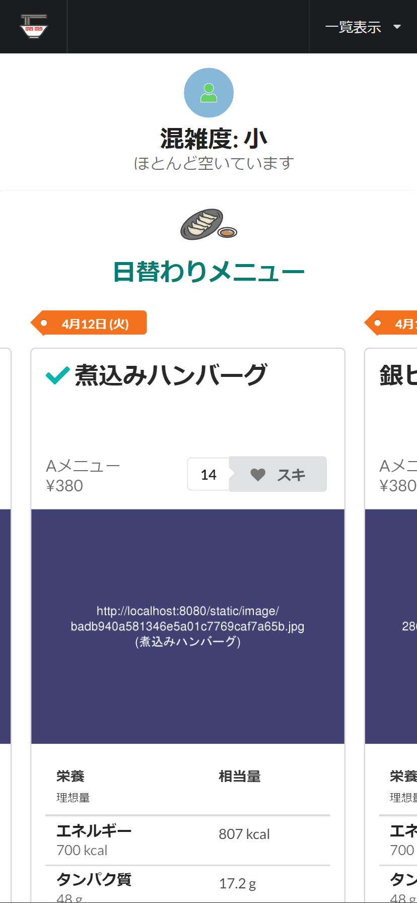
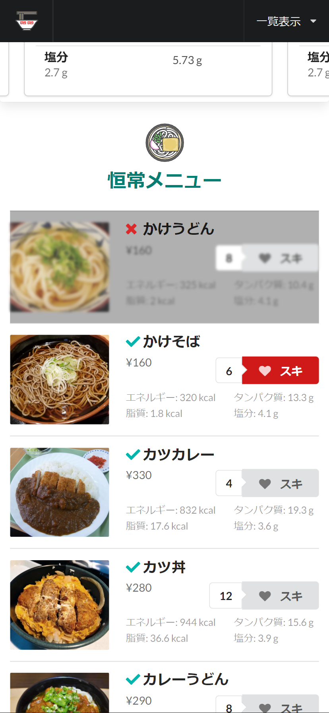

# 学食管理サイト

School project

# Showcase

# How to use

# environment

| Item          | What's used     |
|---------------|-----------------|
| Language      | above Python3.8 |
| API Framework | FastAPI         |
| ORM           | SQLAlchemy      |

# Launch

## load data
> make sure you're in the top directory

`$ python app/load_data.py`

## run server

`$ python app/run.py`

Now you can access the server at `http://localhost:8080/` by default.

## config

edit `app/config.py` to change

- rate limit of `MAX_SOLD_OUT_POST_PER_DAY`, `MAX_CONGESTION_POST_PER_DAY`
- `DATABASE_URI` (default: `sqlite:///database.db`)
- `HOST` (default: `'0.0.0.0'`)
- `PORT` (default: `int(os.environ.get("PORT", 8080))`)
- `HTML_DIR` (default: `'app/templates'`)

## docker-compose
Alternatively, you can use `docker-compose` to run the server.

`$ docker-compose up --build -d`

edit `docker-compose.yml` to change port

> In some cases, websocket might not work properly. \
> I really don't know why.